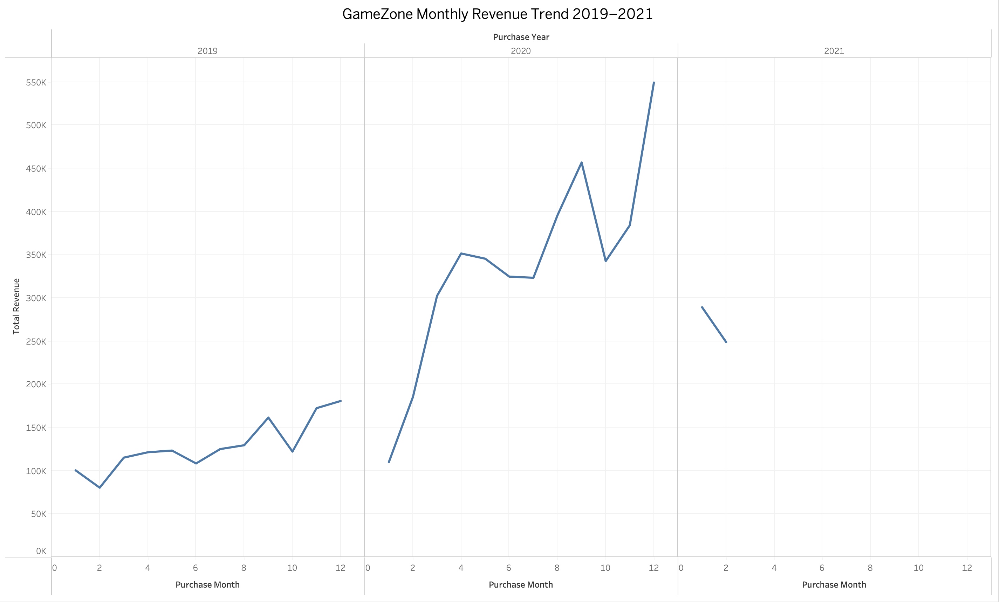
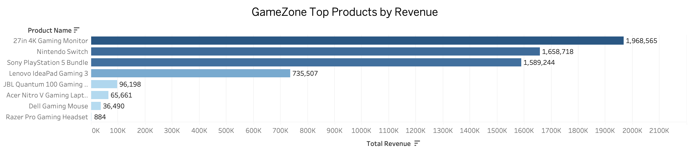
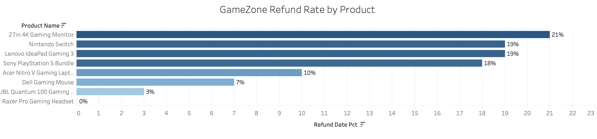
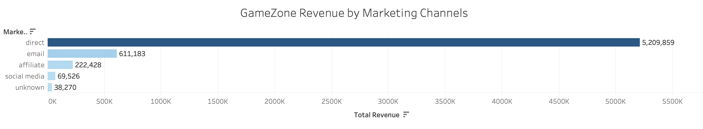
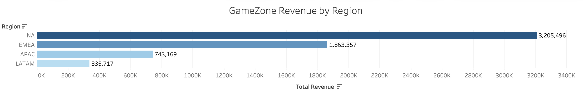

# GameZone Sample Company Sales Analysis

## Project Overview
SQL analysis of 21,864 gaming product orders from 2019–2021 using PostgreSQL and pgAdmin.

GameZone is a sample company founded in 2018 that sells refurbished gaming products worldwide.
Data source: Christine Jiang.

## Dataset
- 21,864 orders across 7 products
- Date range: January 2019 – February 2021
- Platforms: Website and Mobile App
- Regions: NA, EMEA, APAC, LATAM

## Data Cleaning
- Removed duplicate header row
- Fixed data types (integers, numeric, dates)
- Converted date columns from text to DATE format
- Fixed column naming issues

## Analysis
1. Yearly and monthly revenue trends
2. Top products by revenue
3. Refund rate by product
4. Marketing channel performance
5. Platform comparison (website vs mobile app)
6. Regional analysis (NA, EMEA, APAC, LATAM)

## Key Findings

### Revenue Trends
- Total revenue grew approximately 3x from 2019 to 2020, showing strong business growth
- 2020 saw the strongest growth in Q3-Q4, peaking at $550K in December 2020
- 2021 data only covers January-February but already shows high revenue levels

### Top Products
- 27in 4K Gaming Monitor was the #1 revenue product at $1.97M despite fewer orders
- Nintendo Switch had the most orders (~10,386) but ranked #2 in revenue
- Bottom 3 products (Dell Mouse, Acer Laptop, Razer Headset) contributed less than 2% of total revenue

### Refund Rate
- Overall refund rate was 15.95% across all products
- 27in 4K Gaming Monitor had the highest refund rate at 21% — concerning given it is also the top revenue product
- JBL Quantum Headset had the lowest refund rate at 3% indicating high customer satisfaction

### Marketing Channels
- Direct channel dominated with ~65% of total revenue suggesting strong brand recognition
- Email was the second most effective channel
- Social media and affiliate channels are underutilized — potential growth opportunity

### Regional Analysis
- NA (North America) was the largest market by revenue
- EMEA was the largest labeled region with 6,693 orders
- APAC and LATAM represent smaller but potentially growing markets

## Charts
### Monthly Revenue Trend

### Top Products by Revenue

### Refund Rate by Product

### Revenue by Marketing Channel

### Revenue by Region

## Tools Used
- Excel
- PostgreSQL
- pgAdmin
